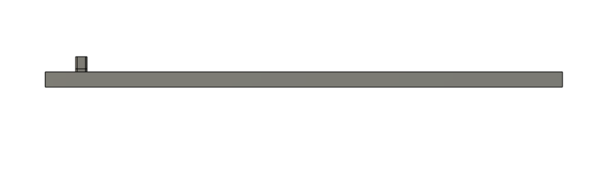
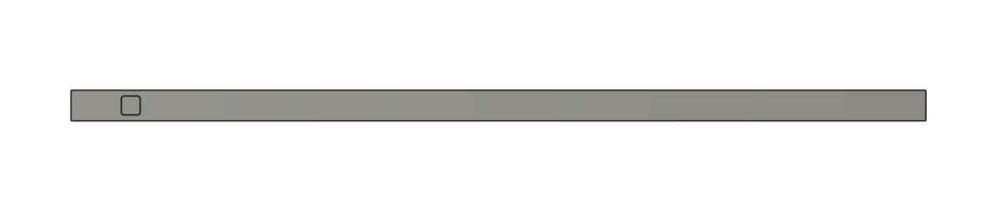
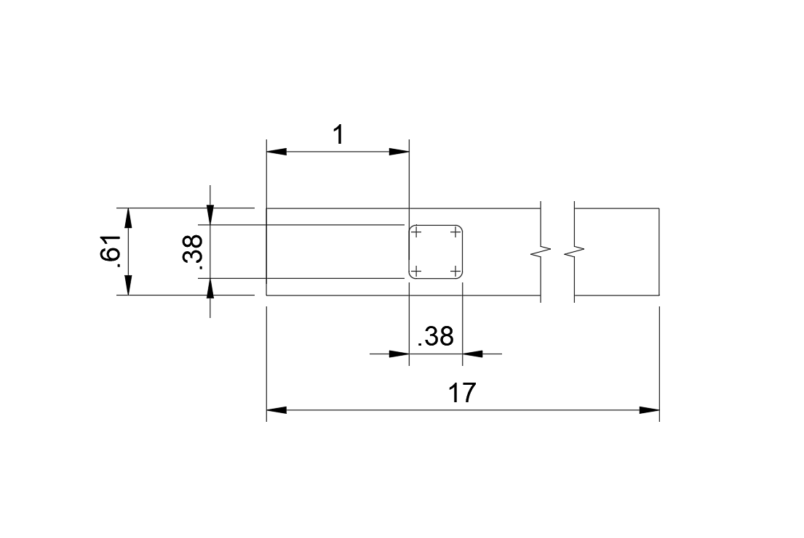

# MAE 3270: Instrumented Torque Wrench Design

This page documents my design, analysis, and finite element modeling work for the MAE 3270 **instrumented torque wrench** project. It tracks the progression from first-cut hand calculations through scripting, CAD modeling, and FEM validation.

---

## 1. Hand-Calculation Overview (First-Cut Design)

To develop an initial design for the torque-wrench handle, I model the handle as a **prismatic cantilever beam** of rectangular cross-section with thickness $$b$$ and width $$h$$. The handle is loaded by a tip force $$F$$ that produces the required torque $$T$$ about the drive:

$$
M = F L
$$

where $$L$$ is the distance from the drive to the load point and $$M$$ is the bending moment at the fixed section.

For a rectangular cross-section, the area moment of inertia and the distance from the neutral axis to the outer fiber are:

$$
I = \frac{b h^{3}}{12},
\qquad
c = \frac{h}{2}.
$$

The corresponding maximum bending stress and longitudinal strain at the outer surface (where the strain gauge is placed) are:

$$
\sigma = \frac{M c}{I},
\qquad
\varepsilon = \frac{\sigma}{E}.
$$

with $$E$$ the Young’s modulus of the chosen material.

The tip deflection is estimated using Euler–Bernoulli beam theory for a cantilever with an end load:

$$
\delta = \frac{F L^{3}}{3 E I}.
$$

These closed-form expressions provide a **first-cut design** for the wrench handle, giving nominal stresses, strains at the gauge location, and load-point deflection for any chosen set of dimensions $$(b, h, L)$$ and material properties $$(E, \sigma_y, S_{\text{fatigue}}, K_{IC})$$.

In the next step, I will expand this analysis by discussing the **material selection, applied loading conditions, and mechanical constraints** that define feasible geometries before moving into parametric design and finite-element modeling.

## 2. Material Selection and Design Constraints

To support the automated design search and later FEM validation, I first selected a material and defined the mechanical constraints governing feasible wrench-handle geometries. I chose **M42 high-speed steel**, a high-strength tool steel commonly used in load-bearing applications requiring toughness, fatigue resistance, and dimensional stability.

### 2.1 Material Properties (M42 Tool Steel)

| Property                                   | Symbol              | Value                             |
|-------------------------------------------|---------------------|-----------------------------------|
| Young’s modulus                           | $$E$$               | $$32 \times 10^6 \ \text{psi}$$   |
| Poisson’s ratio                           | $$\nu$$             | 0.29                              |
| Yield strength                            | $$S_y$$             | $$120 \ \text{ksi}$$              |
| Ultimate tensile strength                 | $$S_u$$             | $$370 \ \text{ksi}$$              |
| Fatigue strength at $$10^6$$ cycles       | $$S_{\text{fatigue}}$$ | $$115 \ \text{ksi}$$          |
| Plane-strain fracture toughness            | $$K_{IC}$$          | $$15 \ \text{ksi}\sqrt{\text{in}}$$ |

M42 provides high yield, ultimate, and fatigue strength, allowing a compact handle cross-section while maintaining acceptable safety factors. Its fracture toughness offers tolerance to small surface flaws or machining scratches, important for a tool that will undergo repeated torque cycling.

### 2.2 Design Loads

The instrumented torque-wrench handle is modeled as a cantilever beam of length $$L$$ loaded by a tip force $$F$$ that produces the required torque $$T$$ about the drive:

$$
M = F L,
\qquad
T = 600 \ \text{in·lbf}.
$$

For a handle length of $$L = 16 \ \text{in}$$, the corresponding applied force is

$$
F = \frac{T}{L}
  = \frac{600}{16}
  = 37.5 \ \text{lbf}.
$$

This load is applied at the free end in both the analytical calculations and the FEM model.

### 2.3 Performance Constraints for the Design Search

To ensure that the handle is structurally safe and produces a measurable strain-gauge output, the design variables $$(b, h)$$ and gauge location $$c$$ must satisfy:

- **Strain-gauge sensitivity requirement** at rated torque  
  $$
  \text{sensitivity} \ge 1.0 \ \text{mV/V at } T = 600 \ \text{in·lbf}.
  $$

- **Yield safety factor**  
  $$
  N_{\sigma} = \frac{S_y}{\sigma_{\text{max}}} \ge 4.
  $$

- **Fracture-toughness safety factor**  
  $$
  N_K = \frac{K_{IC}}{Y \, \sigma_{\text{max}} \sqrt{\pi a}} \ge 2,
  $$
  where $$Y$$ is the geometry factor and $$a$$ is the assumed surface-crack depth.

- **Fatigue safety factor** at $$10^6$$ cycles  
  $$
  N_s = \frac{S_{\text{fatigue}}}{\sigma_{\text{max}}} \ge 1.5.
  $$

- **Deflection constraint:** tip deflection must remain small so the wrench feels stiff and usable.

- The cross-section must provide **sufficient flat area** at distance $$c$$ for commercial strain-gauge bonding.

These material properties and constraints define the feasible design space used in the MATLAB design search. In the next section, I implement the beam-theory equations in a script that sweeps over candidate geometries $$(b, h, c)$$ and identifies the smallest cross-section that satisfies all required performance limits.

## 3. Automated Dimension Search (MATLAB Script)

To iterate the initial design, I wrote a MATLAB script that sweeps the handle height **h** while keeping the thickness **b = 0.50 in** and strain-gauge location **c = 1.0 in** fixed. For each candidate height, the script computes the nominal bending stress, strain, torque-wrench sensitivity (mV/V), and the safety factors for yield, fracture, and fatigue.

The search identifies the **smallest** height **h** that satisfies the design requirements outlined in **2.3**. The condensed MATLAB script used for this automated search is shown below:

The script sweeps **h = 0.40–0.90 in**, applies standard Euler–Bernoulli beam formulas to compute nominal bending stress and deflection, evaluates sensitivity and safety factors for each candidate, and stops as soon as all requirements are met.

The script selected:

- **h = 0.612 in**  
- **b = 0.500 in**  
- **c = 1.000 in**  
- Sensitivity = **1.20 mV/V**  
- Yield SF = **6.24**  
- Fracture SF = **2.00**  
- Fatigue SF = **5.98**  
- Tip deflection = **0.17 in**

These results satisfy all constraints using *nominal* beam-theory stresses. In the FEM analysis that follows, local stresses near the drive block will increase due to stress concentrations, but this automated search provides a reasonable first-cut sizing of the handle geometry.

The next section uses these optimized dimensions to build the CAD model for the full finite-element analysis.

## 4. CAD Model of Improved Torque Wrench Handle

Using the optimized dimensions from the automated MATLAB search, I created a 3D CAD model
of the instrumented torque wrench handle. The handle is modeled as a prismatic rectangular
beam with cross-section **0.61 in × 0.50 in**, supporting a **3/8 in** square drive block
located 1.0 in from the strain-gauge region. The distance from the drive centerline to the
load application point is 16 in, consistent with the hand-calculation model.

A shaded side view of the final CAD geometry is shown below:

A top (plan) view highlights the rectangular cross-section and the location of the drive
block relative to the handle width:

A fully dimensioned drawing is included below to document all key
geometric values used for the FEM model:

These views and dimensions define the geometry that will be imported into ANSYS for the
finite-element simulation to follow.

## 5. Load + Boundary Condition Diagram (FEM Setup)

The figure below summarizes the loading and boundary conditions applied to the torque-wrench model in ANSYS. These conditions match the analytical assumptions used in the hand-calculation design.

### Boundary Conditions
- The **upper 0.40 in** of the 3/8" drive block is modeled as a **fully fixed region**, constraining all translational and rotational degrees of freedom.  
- This represents the clamping condition specified in the assignment.

### Applied Load
- A force of **37.5 lbf** is applied at the end of the handle, located **16 in** from the drive centerline.  
- This corresponds to the required torque:  
  $$
  T = F L = 37.5 \, \text{lbf} \times 16 \, \text{in} = 600 \, \text{in·lbf}.
  $$

### Gauge Location
- The strain gauge is located on the side face of the handle at **c = 1.0 in** from the drive centerline.  
- In the FEM analysis, normal strain in this longitudinal direction is later extracted to compute the wrench sensitivity (mV/V).

### Coordinate System
- A right-handed coordinate system is shown for reference:  
  - **x-axis:** width direction  
  - **y-axis:** vertical  
  - **z-axis:** along the length of the handle 

This diagram establishes the exact loading and constraints used for the finite-element analysis of the improved torque-wrench design.

## 6. Normal Strain Contours (Gauge Direction)

### Strain Probe Location (Shear Strain in Gauge Direction)

To obtain the normal strain that the instrumented gauge would measure under torque, I placed a strain probe on the side surface of the handle at the gauge location $$c = 1.0 \text{ in}$$ from the drive block.

The figure below shows the probe placement used to extract this shear strain at the gauge location:

This probe value is used in Section 8 to report the FEM strain at the gauge and later to compute the torque-wrench sensitivity in mV/V.

## 7. Contour Plot of Maximum Principal Stress (FEM)

The figure below shows the maximum principal stress distribution in the torque-wrench handle under the applied torque of 600 in·lbf. As expected, the highest stresses occur at the transition between the 3/8-in drive block and the handle, where geometric discontinuities create localized stress concentrations.

This plot is used in Section 8 to report the maximum prinicipal stress in the model and to compare FEM results with the hand-calculation predictions.

## 8. Summary of FEM Results

The key quantities extracted from the FEM simulation are summarized in the table below.

| Quantity | FEM Result | Description |
|---------|------------|-------------|
| $$\sigma_{\max}$$ | $$39.1 \ \text{ksi}$$ | Maximum normal stress anywhere in the model, occurring at the drive–handle transition. |
| $$\delta_{\text{tip}}$$ | $$0.201 \ \text{in}$$ | Horizontal deflection at the load application point (free end). |
| $$\varepsilon_{\text{gauge}}$$ | $$5.63 \times 10^{-4} \ \text{in/in} \; = \; 563 \ \mu\varepsilon$$ | Normal strain at the gauge location. |

These results show good agreement with beam theory for the gauge strain (within about 6%), while the FEM predicts a slightly larger tip deflection (about 20% higher) and a much higher peak stress near the drive due to local stress concentrations that are not captured by the simple beam model.

## 9. Torque Wrench Sensitivity (mV/V from FEM Strain)

From the FEM analysis, the strain at the gauge location is  
$$\varepsilon_{\text{gauge}} = 5.63 \times 10^{-4} \; (563 \,\mu\varepsilon).$$

Using a standard constantan-foil gauge with  
$$GF = 2.0,$$  
and instrumenting the wrench with a **full-bridge** configuration (four active gauges arranged so that all grids experience shear strain of equal magnitude, with opposite signs in adjacent bridge arms), the small-strain bridge output is approximated by  
$$\frac{V_{\text{out}}}{V_{\text{in}}} \approx GF \,\varepsilon_{\text{gauge}}.$$

Substituting the FEM strain result gives  
$$\frac{V_{\text{out}}}{V_{\text{in}}} = (2.0)\,(5.63 \times 10^{-4}) = 1.13 \times 10^{-3} \;\text{V/V}.$$

Thus, the torque-wrench sensitivity at the rated torque is  
$$\boxed{\frac{V_{\text{out}}}{V_{\text{in}}} = 1.13 \,\text{mV/V}}$$  
which satisfies the project requirement of achieving at least $$1.0 \,\text{mV/V}$$ at  
$$T = 600 \,\text{in·lbf}.$$

## 10. Strain Gauge Selection

I selected the **OMEGA SGT-2H-350-SY41** shear strain gauge for the torque-wrench handle. It is a constantan-foil shear/torsion gauge designed to measure in-plane shear strain, which matches the strain state produced by torque in the rectangular handle.

**Key properties**
- Resistance: $$350\,\Omega$$  
- Gauge factor: $$GF \approx 2.0$$  
- Pattern: shear grid (±45° orientation)  
- Material: constantan foil on polyimide backing  

**Physical size and fit**
- Grid length ≈ **3.0 mm (0.12 in)**  
- Grid width ≈ **2.6 mm (0.10 in)**  
- Typical carrier size < **10 mm × 5 mm (0.39 in × 0.20 in)**  

The available bonding surface on the handle (0.612 in × 0.50 in cross-section, with a long flat side face) is far larger than the required gauge footprint, so the gauge **fits easily** at the selected location  
$$c = 1.0 \,\text{in}.$$

**Bridge configuration**

Four identical SGT-2H-350-SY41 gauges are wired in a **full-bridge shear configuration**, which:
- rejects bending strain,  
- provides temperature compensation,  
- maximizes output sensitivity.

Using the FEM strain  
$$\varepsilon_{\text{gauge}} = 5.63\times10^{-4},$$  
the full bridge gives  
$$\frac{V_{\text{out}}}{V_{\text{in}}} = GF\,\varepsilon = 1.13 \,\text{mV/V},$$  
which exceeds the required **1.0 mV/V** sensitivity at  
$$T = 600 \,\text{in·lbf}.$$

## 11. Safety Factor Checks

The design must satisfy three safety-factor requirements:

- Yield (or brittle) failure: $$X_0 \ge 4$$  
- Crack growth from an initial surface crack of depth $$a = 0.04 \text{ in}$$: $$X_K \ge 2$$  
- Fatigue stress: $$X_S \ge 1.5$$  

Using the hand-calculation stress for the improved design, the nominal bending stress at the gauge section is  

$$\sigma_{\text{nom}} = 19.2 \ \text{ksi}.$$

For M42 steel, I used  

- Yield strength: $$S_y = 120 \ \text{ksi}$$  
- Fatigue strength at $$10^6$$ cycles: $$S_{\text{fatigue}} = 115 \ \text{ksi}$$  
- Fracture toughness: $$K_{IC} = 15 \ \text{ksi}\sqrt{\text{in}}$$  
- Geometry factor for a small surface crack: $$Y = 1.12.$$

The safety factors are then

- **Yield / static failure**

  $$X_0 = \frac{S_y}{\sigma_{\text{nom}}}
  = \frac{120}{19.2} \approx 6.24.$$

- **Crack growth from a surface crack**

  $$X_K = \frac{K_{IC}}{Y \, \sigma_{\text{nom}}\sqrt{\pi a}}
  \approx 2.00.$$

- **Fatigue**

  $$X_S = \frac{S_{\text{fatigue}}}{\sigma_{\text{nom}}}
  = \frac{115}{19.2} \approx 5.98.$$

All three safety factors **exceed the required limits**  
($$X_0 \ge 4,\ X_K \ge 2,\ X_S \ge 1.5$$), so the final design is acceptable with respect to yield, fracture, and fatigue.
